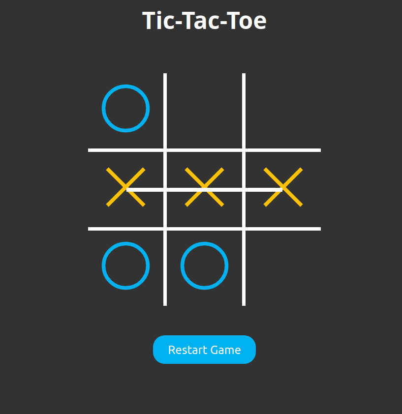

# 🎮 Tic-Tac-Toe

A simple browser-based Tic-Tac-Toe (3-in-a-row) game built with HTML, CSS, and JavaScript.
Two players take turns on a 3×3 grid until one wins or the game ends in a draw.

## 🛠️ Tech Stack

- HTML
- CSS
- JavaScript (Vanilla)

## 🚀 Features

- 2-player local mode
- Real-time win/draw detection
- Reset button to start a new game
- Clean and minimalistic design

## 📸 Preview

## 🔧 How to Run

Simply open the `index.html` file in any modern web browser — no setup needed.

---
